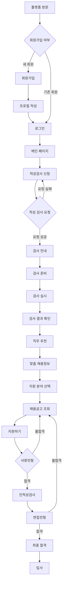
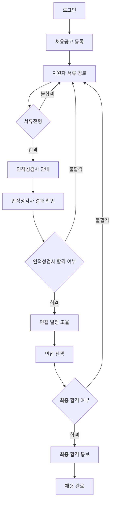
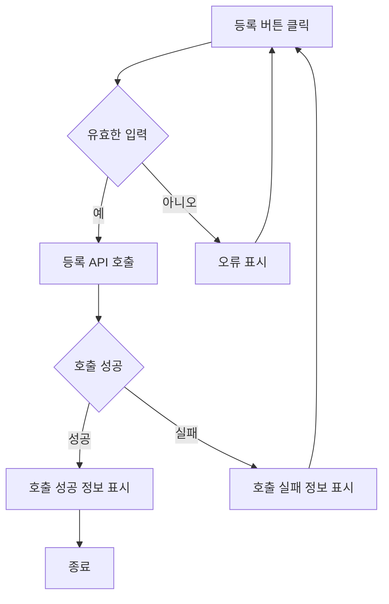
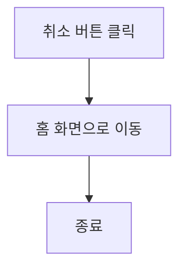

# 기능 정의서

**기업 채용담당자로서, 나는 새로운 구직자를 채용하고 싶습니다.** 
**구직자는 자신의 프로필과 포트폴리오를 최신 상태로 유지하고 싶습니다.**

- **전체 흐롬도**

## 유저 플로우 다이어그램

- **구직자 유저 플로우 다이어그램**

- **기업 채용 담당자 유저 플로우 다이어그램**

## 기능별 설명

### 1. 기능명: 구직자 프로필 등록

- 기능 설명
    - 구직자는 자신의 기본 정보를 바탕으로 프로필을 등록할 수 있습니다. 구직자 자신의 프로필을 수정을 하여 최신 상태로 유지 할 수 있습니다.
- 입력 항목
    - 이메일, 비밀번호, 이름, 전화번호, ID, 주소, 주민등록번호
    - 구직자 ID: 고유 식별자 (자동 생성)
    - 이름: 문자열, 최대 10자
    - 연락처: 문자열, 최대 15자 (유효성 검사 필요)
    - 이메일: 문자열, 최대 50자 (유효성 검사 필요)
    - 주소: 선택형 목록(프론트엔드에서 제공)
    - 학력 및 전공: 선택형 목록(프론트엔드에서 제공)
    - 수상경력: 문자열, 최대 50자
    - 사진: 이미지 형식 선택(png, jpeg), 반명함 사이즈(3×4cm)
    - 주민등록번호: 문자열, 13자(유효성 검사 필요)
    - 경력: 문자열, 최대 300자
    

### 1.1 사용자 액션

#### 등록

- 등록 버튼 클릭
    - 입력 항목 유효성 검사 실행
    - 유효성 검사 오류 발생시 등록 절차는 종료되며 사용자에게 오류 정보 알림
    - 유효성 검사 통과시 등록 API 호출
    - API 호출 성공 후 요약 정보 표시
    - 홈 화면으로 전환

- 취소 버튼 클릭
    - 홈 화면으로 전환

