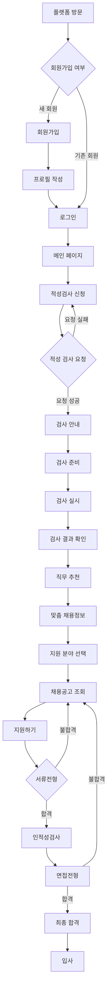
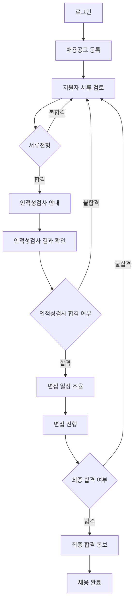
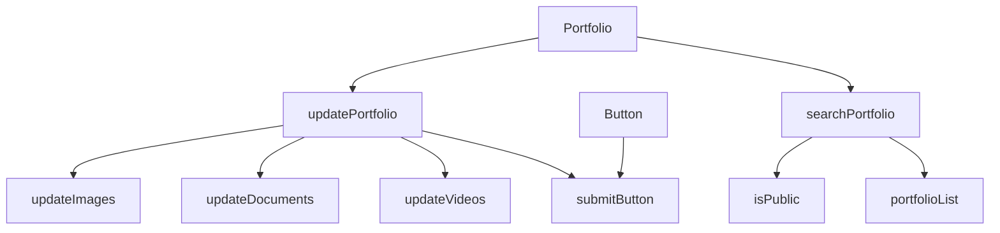
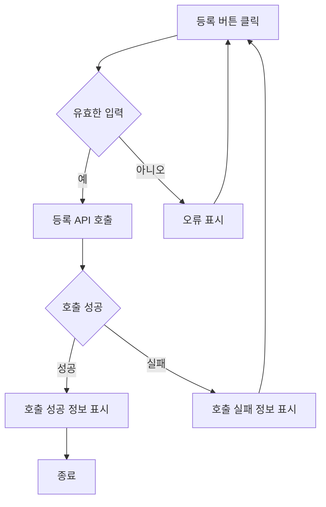
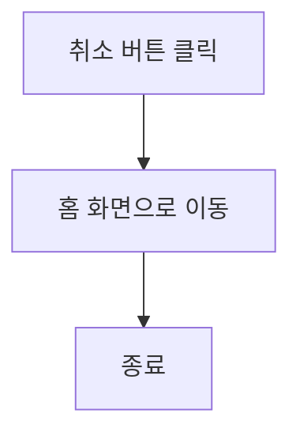

# 기능 정의서

- 각 기능들에 대한 세부 설명
- 기업 채용 담당자와 구직자의 유저 플로우 다이어그램
- 각 사용자가 구직 플랫폼을 사용 했을 때의 작업 흐름에 대한 설명

#### 각 구직 플랫폼을 사용할 때의 목적
> **기업 채용담당자로서, 나는 새로운 구직자를 채용하고 싶습니다.** 
> **구직자는 자신의 프로필과 포트폴리오를 최신 상태로 유지하고 싶습니다.**

## **전체 유저 플로우 다이어그램**

## 사용자별 유저 플로우 다이어그램

### **구직자의 유저 플로우 다이어그램**

### **기업 채용 담당자 유저 플로우 다이어그램**

## 기능별 설명
1. 로그인 기능
2. 프로필 조회 기능
3. 구직자 매칭 및 기업 추천 기능
4. 포트폴리오 업로드 및 조회 기능
5. 구직자 매칭 및 기업 추천 기능

### 1. 로그인 기능
사용자가 로그인하게 되는 과정을 설명함.  
로그인 정보와 일치하지 않을 경우 다시 사용자가 입력을 하게 됨.

### 2. 프로필 조회 기능

직무 적성 온라인 채용 플랫폼 프로필 조회 기능의 컴포넌트 관계도는 프로필 공개 범위 설정과 검색 및 필터링 기능 등의 상호작용과 의존성을 보여주며, 사용자 프로필 조회, 공개 범위 설정, 검색 및 필터링 기능 등을 구현하는 데 사용됨.

### 2. 포트폴리오 업로드 및 조회 기능

---

### 3. 구직자 매칭 및 기업 추천 기능
구직자 매칭 및 기업 추천 기능은 기업 데이터, 구직자 데이터를 AI,알고리즘,머신러닝을 이용해 기업과 구직자간의 상성이 좋은 매칭을 시켜줌.

### 4. 직무적성 테스트 기능
구직자는 검사지 웹페이지를 통해 직무적성검사를 진행 할 수 있음.
관리자(채용 담당자)는 검사지 관리 프로그램을 통해 검사지를 수정 삭제, 등록, 조회를 할 수 있음.

## 사용자의 세부 액션
- 등록
- 등록 취소

### 등록

- 등록 버튼 클릭
    - 입력 항목 유효성 검사 실행
    - 유효성 검사 오류 발생시 등록 절차는 종료되며 사용자에게 오류 정보 알림
    - 유효성 검사 통과시 등록 API 호출
    - API 호출 성공 후 요약 정보 표시
    - 홈 화면으로 전환

### 등록 취소
- 취소 버튼 클릭
    - 홈 화면으로 전환

